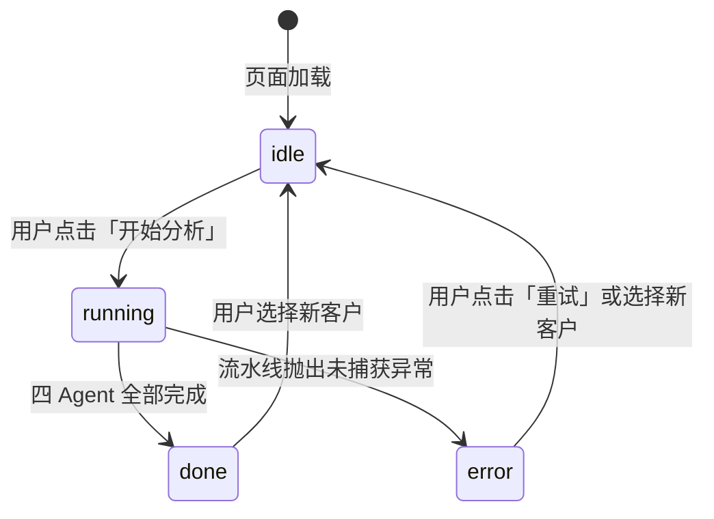

# 08. 状态管理

> 本文件是 PRD/ 文件夹的第 8 部分。如需了解产品全貌请先读 [README.md](./README.md)。
> 上一模块：[07-business-logic.md](./07-business-logic.md) · 下一模块：[09-error-handling.md](./09-error-handling.md)

---

## 状态层级

本项目有两层状态，各自职责清晰：

| 层级 | 技术实现 | 生命周期 | 职责 |
|------|---------|---------|------|
| Agent 流水线状态 | LangGraph `AgentState` (TypedDict) | 单次流水线执行期间 | 在四个 Agent 之间传递数据 |
| 界面交互状态 | Streamlit `st.session_state` | 浏览器 Session 期间 | 控制界面渲染和用户操作 |

---

## LangGraph AgentState

```python
# graph/state.py
from typing import TypedDict, Optional, Annotated
from models.customer import Customer
from models.outputs import (
    ChurnRiskAssessment, ProductRecommendation,
    RetentionStrategy, MarketingScript
)

class AgentState(TypedDict):
    # ── 输入（流水线开始时填充，不再修改）──
    customer_id:   str
    customer_data: Customer

    # ── 各 Agent 输出（顺序填充，后续节点只读）──
    churn_assessment:       Optional[ChurnRiskAssessment]    # 由 customer_insight_node 写入
    product_recommendation: Optional[ProductRecommendation]  # 由 product_insight_node 写入
    retention_strategy:     Optional[RetentionStrategy]      # 由 strategy_node 写入
    marketing_script:       Optional[MarketingScript]        # 由 marketing_node 写入

    # ── 运行控制（每个节点完成时更新）──
    current_step: str        # "start" | "customer_insight" | "product_insight" | "strategy" | "marketing" | "done"
    errors:       list[str]  # 每步错误追加，不中断流程；空列表=全程无错误
    is_degraded:  bool       # True = 任意一步使用了降级方案
```

**LangGraph 节点更新规则**：
- 每个节点函数返回 `dict`，只包含该节点要更新的字段
- LangGraph 自动将返回的 dict 合并到 `AgentState`
- 后续节点只读之前节点写入的字段，不覆盖

---

## Streamlit Session State

**初始化**（在 `app.py` 的入口处执行一次）：

```python
def init_session_state():
    defaults = {
        "selected_customer_id": None,      # str | None
        "pipeline_result":      None,      # AgentState | None（最终状态）
        "pipeline_status":      "idle",    # "idle" | "running" | "done" | "error"
        "current_step":         0,         # int 0-4
        "batch_results":        [],        # list[dict]
        "batch_running":        False,     # bool
        "show_reasoning":       True,      # bool，是否展示 Agent 推理中间过程
    }
    for key, val in defaults.items():
        if key not in st.session_state:
            st.session_state[key] = val
```

**状态流转图**：



**`current_step` 编码**：

| 值 | 含义 |
|----|------|
| 0 | 未开始 |
| 1 | 客户洞察 Agent 完成 |
| 2 | 产品洞察 Agent 完成 |
| 3 | 经营策略 Agent 完成 |
| 4 | 营销执行 Agent 完成（全流程完成） |

---

## 状态持久化 vs 临时

| 状态字段 | 类型 | 持久化？ | 说明 |
|---------|------|---------|------|
| `pipeline_result` | AgentState | ❌ 临时 | 刷新页面丢失，重新分析即可 |
| `batch_results` | list[dict] | ❌ 临时 | 用 `st.download_button` 导出 CSV 后可持久化 |
| `show_reasoning` | bool | ❌ 临时 | 用户偏好，刷新重置 |
| API Key | string | ✅ `.env` 文件 | 永远不存 session_state，从环境变量读取 |

> 本项目 V1 **不做**服务端持久化（数据库/文件）。所有状态只在当前浏览器 Session 中存活。
